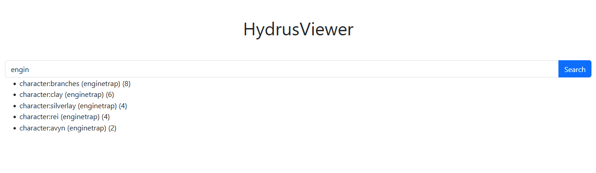
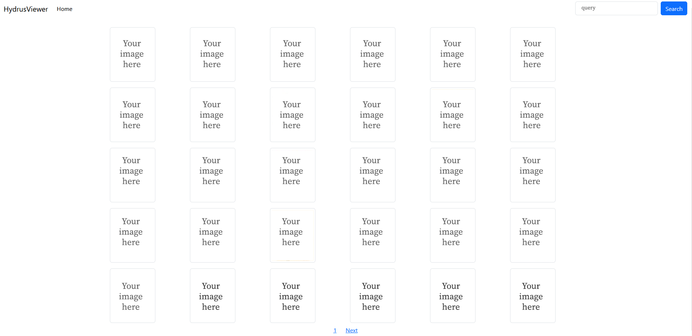

# Hydrus Viewer

## Why

When I started this project, it seemed to me that there were no good and simple solutions for the hydrus web gallery. Those that were, took time to set up and I didn't like them. So I decided to write my own gallery.

## Features

1. Search the gallery by tags
2. View images 
3. Import URLs to hydrus
4. Optimized for PC and mobile
5. Simply to install and set up.

## How to install

Build from sources:

1. Clone the repository 

   `git clone https://github.com/viktor02/hydrus-viewer`

2. cd to cloned directory 

   `cd hydrus-viewer`

3. Install from source 

    `pip install .`

4. Run

    `hydrus_viewer <access_key>`

5. App will start at 127.0.0.1:8020 (you can change IP and Port with --bind and --port args)

## How it looks

