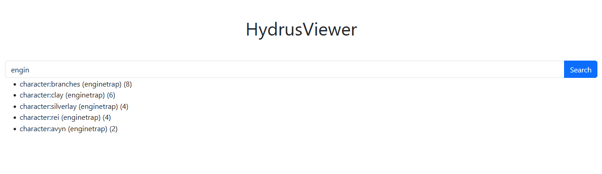

# Hydrus Viewer

## How to install

Build from sources:

1. Clone the repository 

  `git clone https://github.com/viktor02/hydrus-viewer`
2. cd to cloned directory 

`cd hydrus-viewer`
3. Install from source 

`pip install .`

## How it looks

